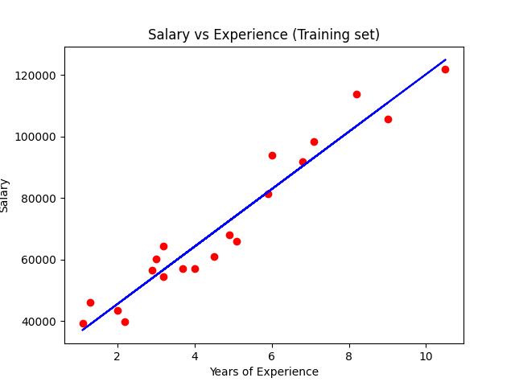
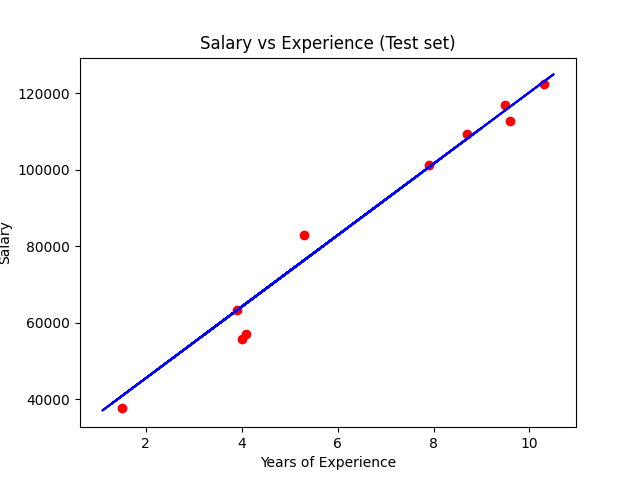

# Salary_prediction
It is a simple mini-project using Linear Regression which will predict the salary according to the experience the employee will have!

*Data base used for training and testing = Salary_Data.csv

<b>4 simlpe steps to :- </b>

1. Importing the dataset.
2. Splitting dataset into training set and testing set.
3. Initializing the regression model and fitting it using training set.
4. That's it, you're good to go! Go on predicting ;)

  

